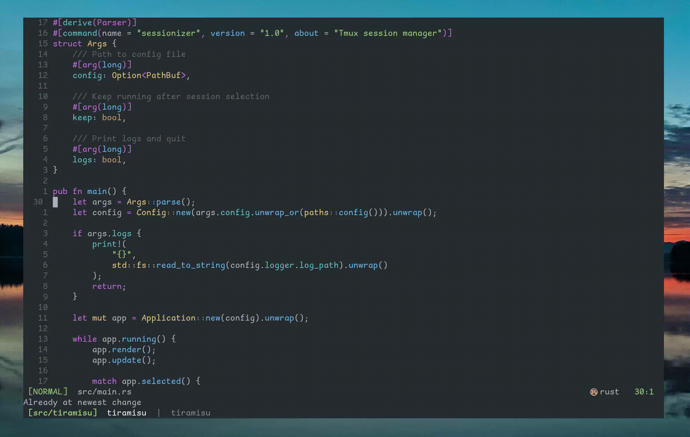

# tiramusu



## Installation

- Download and install the [latest release](https://github.com/AlekseySav/tiramisu/releases)

- Or install via ***homebrew***:
```
$ brew install alekseysav/tiramisu/tiramisu
```

## Configuration

By default, configuration is stored at
- Windows: %APPDATA%\tiramisu\config.toml
- Unix: $XDG_CONFIG_HOME/tiramisu/config.toml or ~/.config/tiramisu/config.toml

Example of `config.toml`:

```toml
[[session]]
  root = "$HOME/src/(*)"
  name = "src/$1"
  [[session.window]]
    name = "$1"
    command = "nvim ."
  [[session.window]]
    name = "shell"

[logger]
  level = "info"
```

### Integration with tmux

`tiramisu` may run within `tmux-popup`:

```
bind-key j display-popup -S "fg=default,bg=default" -w 70% -h 70% -E "tiramisu"
```
